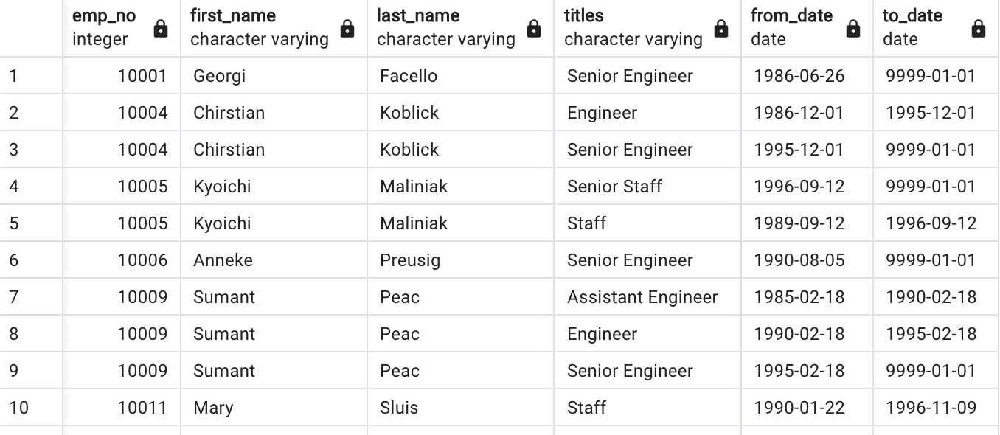
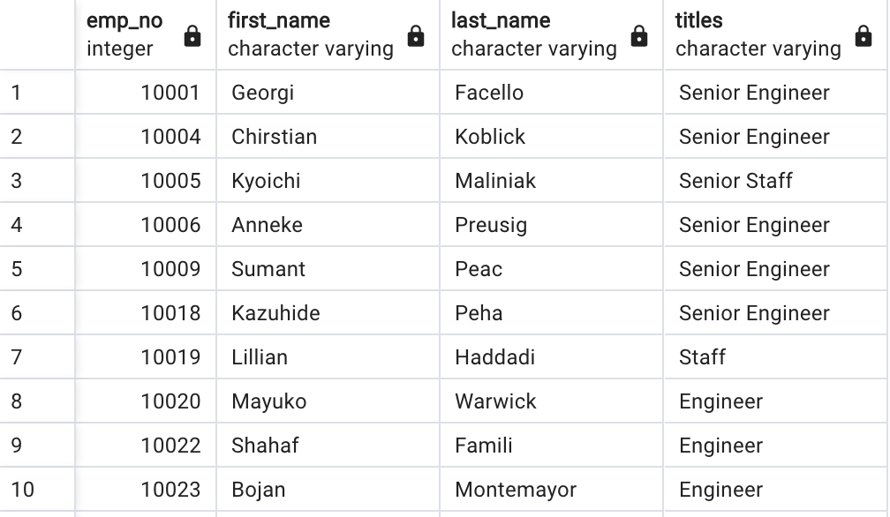
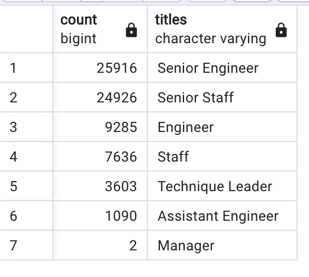
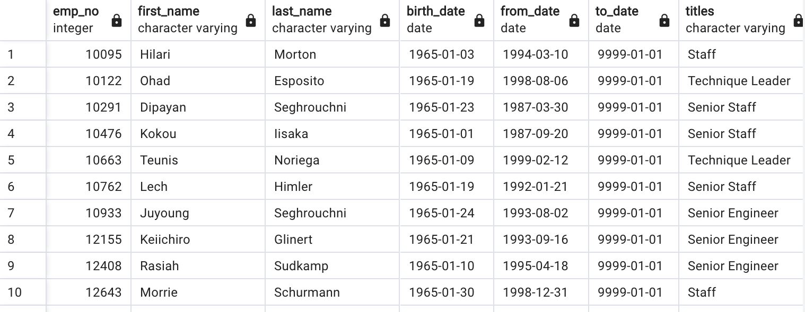

# Pewlett-Hackard-Analysis

# **Purpose**
The purpose of this assignment was to help Hewlett Packard prepare for the “Silver Tsunami” as many of their current employees are reaching retirement age. Using the CSV data files provided by Hewlett Packard, the files were analyized in PGAdmin. Tables were created to discover and display the needed information then saved to a readable format.

## **Goal**
- Retrieve the number of retiring employees by title
- Retrieve employees eligible for the mentorship program
- Write a report on the employee database analysis for Pewlett Hackard

## **Resources**
- Resources: employees.csv, dept_emp.csv, titles.csv
- Software: PGAdmin/ SQL, Excel, Visual Studio Code

## **Results**

The first goal of this project was to retrieve the number of retiring employees by title. To do this I took three steps:
1. I first created a Retirement Titles table that holds all the titles of employees who were born between January 1, 1952 and December 31, 1955. 

2. Next, I used the DISTINCT ON function to filter this table for employees with duplicate titles due to promotion and contains their most recent title. I also excluded employees who have left the company pulling only active employees from the table.

3. Then, I used the COUNT() function to create a table that has the number of retirement-age employees grouped by title and ordered by title with the highest count.

To achieve the second goal of this project, retrieve employees eligible for the mentorship program, I created one table. The mentorship-eligibility table holds current employees who were born between January 1, 1965 and December 31, 1965.

Based off the results, there are four major takeaways:
- Based on the retirement_titles table, there are over 133,776 employees approaching retirement. However, this table contains duplicates and inactive employees.
- Based on the unique_titles table, there are 72,458 employees who are approaching retirement. This information does not include duplicated or inactive employees.
- From the retiring_titles table: The largest number of retiring employees are with the title of Senior Engineer (25,916) followed by Senior Staff (24,926). This information excludes duplicated employee information and the employee’s most recent title.
- Based on the mentorship_eligibility table, there are 1,549 eligible employees for the mentorship program.

## **Summary**
The following conclusions can be made based on the analyzed data of Pewlett Hackard:

- As the "silver tsunami" begins to make an impact, 72,548 employees will need to be replaced within a few years.
- Based on the qualification from Pewlett Hackard for the mentorship program, there are 1,549 employees who meet the standards for the program. This is not enough people to train the next generation. Hewlett Packard will either have to reevaluate their standards for the program or create a special program to handle the amount of people that will need to be trained. Such as having mentorship classes where the mentor can have a greater reach to future employees.
- The problems posed by the mass retirement creates many further questions. The data set can be further analyzed to show more insights that may help the management team form solutions to the future manpower issue. One question that arises is based on the mentorship_eligibilty table. There are over 1,500 eligible employees for the program, however what is the count based on title? The mentorship program should be specific based on title. The Senior Engineer should not be a mentor to Staff, The Senior Staff should be a mentor to the Staff. Therefore it is important to consider how many eligible mentors there are based on title. This query shows that of the Senior Staff title, only 418 are eligible to be mentors and 399 Engineers are eligible. This is not enough to support the over 24,000 that will be retiring. 
-This brings us to the second query. What if the eligibility requirements to the mentorship program were changed? What if the program included mentors born in between 1964 and 1965 instead of just 1965. If you were to run this query, it would produce around 19,500 eligible mentors. This simple change could help the program become feasible. The number of eligible mentors greatly increases if this parameter is changed. Pewlett Hackard should consider changing this parameter if it wants to successfully train and mentor the next generation of employees.
